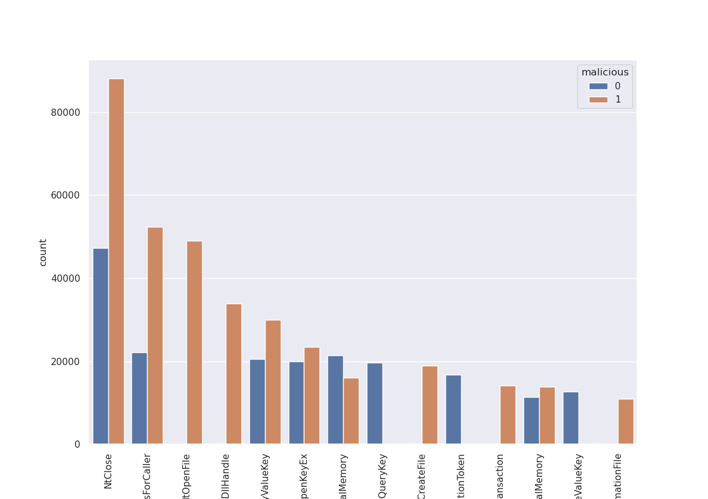

# SC1015 Mini-Project
## Overview
Mini-Project for SC1015 (Introduction to Data Science and Artificial Intelligence) of Lab Group **FDDA, Team 7**.
This repository contains all Jupyter notebooks, datasets, images, videos, and references that are used in the project.

## Contributors
- Amos Ng - [**@YakunToast**]
- Kuo Eugene - [**@Xeonia**]

## Project Description
### Introduction
A crucial task in the field of cybersecurity is effective malware detection. This task is essential for protecting computer systems and networks from malicious threats.

### Problem Formulation
Given a set of Windows PE binaries, our aim is to classify each of them **accurately** as malicious or benign.

### Dataset
We used an open-source dataset, [DikeDataset](https://github.com/iosifache/DikeDataset). It is a **labelled** dataset containing both benign and malicious binaries.

This dataset is then detonated using the [**CAPEv2 sandbox**](https://github.com/kevoreilly/CAPEv2) to capture the sequence of API calls made by each of the binaries.

The malicious label is then restored along with the resulting sequence of API calls and saved to `dataset/dataset.csv`.

#### Data Preparation
Our approach involves processing (or detonating) both the malware samples and benign binaries provided by *DikeDataset* using **CAPEv2 sandbox**, then capturing the sequence of API calls made by each of the binaries.

To prepare the dataset, we:

1. Loaded the CSV file and copied the dataframe.
2. Truncated and obtained only 450/900 samples from both malicious == 1/0, to ensure model is not overtrained on malicious samples.
3. Cleaned the dataset by creating a tokenizer to convert the API column into numerical indices, and then padded the sequences to have the same length.
4. Converted the thread id and index columns into numerical values and concatenated the numerical values and the API indices.
5. Encoded the label column using LabelEncoder.
6. Split the data into training and testing sets using train_test_split.

#### Exploratory Data Analysis
After extracting the relevant data, in order to gain more insight on API call patterns, we determined the distribution of API calls made by both malicious and benign PE binaries and visualized the comparison of API call frequencies between malicious and benign samples.

However, as we noted, while some API calls tended to be called upon more _or only_ by malicious binaries, it is not a good indicator of maliciousness by itself, hence we decided to train a LSTM (Long-Short Term Memory) model instead.

#### Model Training and Evaluation
We trained and tested a **LSTM** model with Keras using our labelled data. The model architecture consists of two LSTM layers with 50 units each, and a dense layer with softmax activation. We compiled the model with categorical cross-entropy loss, Adam optimizer, and accuracy metric.

To train the model, we:

1. Reshaped the data for LSTM.
2. Converted the labels to categorical.
3. Defined utility callbacks for training, including ModelCheckpoint, EarlyStopping, and PlotLossesKeras.
4. Trained the model with 10 epochs, batch size of 64, and validation data.

To evaluate the model, we:

1. Loaded the best model from the checkpoint.
2. Evaluated the model on the test data.
3. Predicted labels for test data and converted predictions to labels using a threshold of 0.5.
4. Calculated the F1 score using the predicted labels and true labels.

### Results and Conclusion
Based on our results, the LSTM model has shown to be relatively effective in classifying Windows PE binaries as malicious or benign. We achieved a relatively high accuracy rate, indicating that the model is able to learn patterns in the API calls that distinguish between malicious and benign behavior.

This project has important implications for cybersecurity, and it demonstrates the potential of machine learning approaches for malware detection.

### References
- https://github.com/kevoreilly/CAPEv2
- https://keras.io/api/
- https://github.com/iosifache/DikeDataset
- https://medium.com/slalom-build/detecting-malicious-requests-with-keras-tensorflow-5d5db06b4f28
